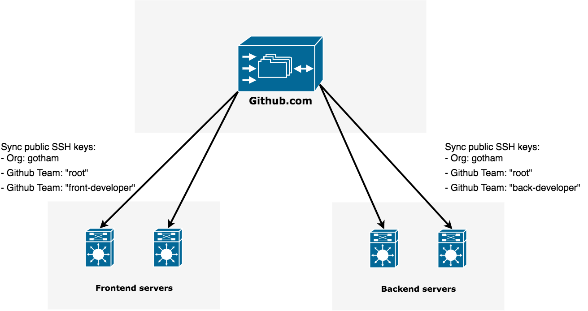

# Sync ssh keys

Sync public ssh keys to `~/.ssh/authorized_keys`, based on Github/Gitlab organization membership.



## Install

```bash
$ export GO111MODULE=on
$ go get github.com/samber/sync-ssh-keys
```

or

```bash
$ curl -L -o /usr/local/bin/sync-ssh-keys \
      https://github.com/samber/sync-ssh-keys/releases/download/v0.4.0/sync-ssh-keys_0.4.0_linux-amd64
$ chmod +x /usr/local/bin/sync-ssh-keys
```

or 

```bash
$ docker pull samber/sync-ssh-keys:0.4.0
$ docker run --rm samber/sync-ssh-keys:0.4.0 --github-username samber
```

### Sync using a crontask

```bash
$ crontab -e
```

Then:

```
# sync once per hour
0 * * * * sync-ssh-keys --github-token XXXXXXXXXXXXXXX --github-org epitech --github-team sysadmin --output /root/.ssh/authorized_keys
```

## Usage

```bash
$ sync-ssh-keys --help
usage: sync-ssh-keys [<flags>]

Flags:
      --help                   Show context-sensitive help (also try --help-long and --help-man).


  -o, --output=OUTPUT          Write output to <file>. Default to stdout
      --Werror=WERROR          Treat warning as errors. Fatal error if organization, team or user does not exist.


      --local-path=LOCAL-PATH  Path to a local authorized_keys file. It can be useful in case of network failure ;)


      --github-endpoint=GITHUB-ENDPOINT
                               Github Enterprise endpoint.
      --github-token=GITHUB-TOKEN
                               Github personal token.
      --github-org=GITHUB-ORG  Github organization name.
      --github-team=GITHUB-TEAM ...
                               Team(s) allowed to access server.
      --github-username=GITHUB-USERNAME ...
                               Username(s) allowed to access server.
      --exclude-github-username=EXCLUDE-GITHUB-USERNAME ...
                               Username(s) to explicitly exclude.


      --gitlab-endpoint=GITLAB-ENDPOINT
                               Gitlab endpoint.
      --gitlab-token=GITLAB-TOKEN
                               Gitlab personal token.
      --gitlab-group=GITLAB-GROUP ...
                               Group allowed to access server.
      --gitlab-username=GITLAB-USERNAME ...
                               Username(s) allowed to access server.
      --exclude-gitlab-username=EXCLUDE-GITLAB-USERNAME ...
                               Username(s) to explicitly exclude.


      --version                Show application version.
```

### Simple user

```bash
$ sync-ssh-keys --github-username samber

#
# Github
#

ssh-rsa AAAAB3NzaC1yc2EAAAADAQABAAABAQDhDlAK8ewcwC............. samber@github

ssh-rsa AAAAB3NzaC1yc2EAAAADAQABAAACAQCuLVeU6zqRrQ............. samber@github
```

### On Gitlab

```bash
$ sync-ssh-keys --gitlab-token XXXXXXXXXXXXXXXXXX \
                --gitlab-username samuelberthe
```

### More users

```bash
$ sync-ssh-keys --github-username samber \
                --github-username john \
                --github-username doe
```

### All members of an organizations

```bash
$ sync-ssh-keys --github-token XXXXXXXXXXXXXXX \
                --github-org epitech \
                        > /root/.ssh/authorized_keys
```

### All members of teams "root" and "sre", of a Github organizations

```bash
$ sync-ssh-keys --github-token XXXXXXXXXXXXXXX \
                --github-org epitech \
                --github-team root \
                --github-team sre \
                        > /root/.ssh/authorized_keys
```

### All members of an organizations excluding myself ;)

```bash
$ sync-ssh-keys --github-token XXXXXXXXXXXXXXX \
                --github-org epitech \
                --exclude-github-username samber \
                        > /root/.ssh/authorized_keys
```

### In case of network failure, lets fallback to an hard-coded ssh key

```bash
$ sync-ssh-keys --github-username samber \
                --local-path /root/.ssh/instance_keys \
                        > /root/.ssh/authorized_keys
```

### Pass destination file as parameter

```bash
$ sync-ssh-keys --github-username samber \
                -o /root/.ssh/authorized_keys
```

### Gitlab + Github + Local providers

```bash
$ sync-ssh-keys --github-username samber \
                --gitlab-username john-doe \
                --local-path /root/.ssh/instance_keys \
                -o /root/.ssh/authorized_keys
```

### Gitlab Subgroup

```bash
$ sync-ssh-keys --gitlab-token XXXXXXXXXXXXXXX \
                --gitlab-group "gitlab-org/cluster-integration" \
                --gitlab-group "gitlab-org/monitor" \
                -o /root/.ssh/authorized_keys
```

## About rate limiting

⚠️ Request volume can grow very fast on large infrastructures. It will be multiplied by the number of servers.

This is highly recommanded to use a dedicated access token linked to dedicated Gitub/Gitlab account.

Github rate limits:
- 5000 req/h authenticated
- 60 req/h/IP unauthenticated

Gitlab rate limits:
- 10 req/s/IP
- 600 req/min

We send approximataly 1 request per organisation + 1 per group + 1 per user.

### Example

```bash
$ sync-ssh-keys --github-token XXXXXXXXXXXXXXX \
                --github-org epitech \
                --github-team root \
                --github-team sre \
                --exclude-github-username samber \
```

- "Root" team having 3 members.
- "SRE" team having 10 members.
- Executed at the same time on 50 servers

50 servers * (1 org + 2 teams + 3 users + 10 users) = 800 requests

### Trade-off

If you have too many servers and/or too many users:

- Sync only twice a day.
- At different time on each server.
- Fetch once and scp everywhere.
- Execute binary with `-Werror` and redirect to `.ssh/authorized_keys` using `-o` instead of `>`. It will write ssh keys in a lazy way, if no error happened.

## Contribute

```bash
$ make run
```

```bash
$ make release
$ make docker-release
```

## License

[MIT license](./LICENSE)
